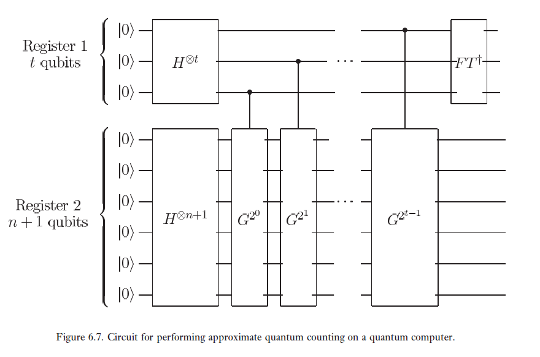

# Quantum counting

As you've probably learned from the other Microsoft Katas, Grover's algorithm is a way of accelerating unstructured search on quantum computers.  Importantly, one must know both the total size of the search space ( ), and the total number of solutions to the search problem ( ), to know the angle ( ) that each Grover step rotates the state by:

This provides a stopping condition, becausing applying too many Grover steps will rotate the state past the point when the maximal success probability is achieved (i.e. when meausuring the output register will produce a bitstring that is included in the known solution set).  This discussion begs the question: what if you don't know the total number of solutions beforehand?  

One could always run Grover search for a range of different s, mesuring the output over each iteration and checking for those which are valid solutions, but we can do better.  The quantum couting algorithm (NC pg. 263) presents a solution, where one can use the quantum phase estimation algorithm (QPE) to estimate the eigenvalues of some unitary  , where   is the Grover interation, which is 

in the 2-d basis spanned by  and , which are superpositions over all solutions and non-solutions to the search problem, respectively.    has eigenvalues  and , which we then seek to estimate via quantum phase estimation.  Knowing  and  , we can compute   and thus know how many solutions exist to our search problem.  The circuit is 

Importantly, in QPE we need to prepare an eigenstate of   on the target register, in order to extact the eigenvalue of  into the phase of the control qubits.  Since don't know  yet, we cannot prepare an eigenstate, so we just prepare a uniform superposition, which is a superposition of  and , by which we denote the two eigenvectors of  (these lie in the same plane as  and , but define a rotated basis).  Thus, we extract either  or  with some probability, which are both fine since we plug them into  in the end.

In the displayed circuit diagram,  refers to the number of qubits needed in QPE, and ultimately determines the resolution with which we can learn , and also the probability with which the circuit succeeds at all.  The  register refers to the workspace of the Grover unitary, which just needs however many qubits are involved in the search algorithm.
